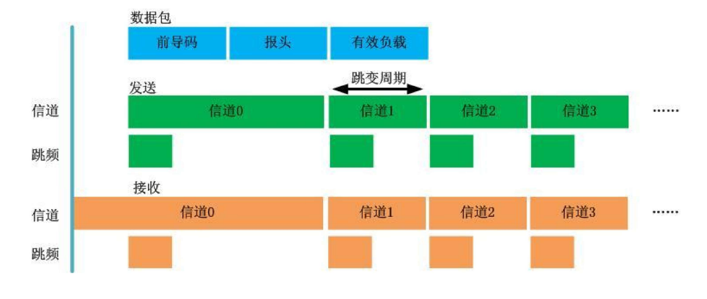

---
fignos-cleveref: TRUE
fignos-plus-name: 图
fignos-caption-name: 图

tablenos-cleveref: TRUE
tablenos-caption-name: 表格
tablenos-plus-name: 表
...

基于LoRa的饮水机水量无线监测送水系统设计

[TOC]

摘 要：为了提高饮水机送水效率,在综合分析物联网关键技术的基础上，延伸出 SX1278 无线射频芯片的 LORA 技术。LORA 技术的核心在于数据的传输，首先对 LORA 数据包进行全面的定义及解析，然后由通信规约实现的业务逻辑引申出唤醒机制在整个系统中数据传递的作用，其次对智能送水饮水机送水系统中各模块的设计思路进行详细描述与验证，且通过对 SX1278 无线芯片 LORA 技术的研究，极大的扩充和填补了目前嵌入式无线通信领域的通信方式，也为无线水量检测送水系统的发展带来了跨越式的机会。

关键词：LoRa; SX1278; 智能送水饮水机; 智能饮水机;

# 0 引言

20世纪90年代，麻省理工学院的 Kevin Ashton提出了物联网的概念，并作如下定义：所有的事物都是通过传感器，比如无线射频识别(radio frequency identification，RFID)连接到互联网，实现智能化管理。[@xiaojiang2010services]物联网可以实现物理世界与网络空间的互联与整合，它代表了未来网络化的趋势，引领信息产业革命的第３次浪潮。信息网络已广泛地应用于日常生活的各个方面，提供了很多设备之间的互联，比如娱乐设备、家庭应用、飞机、个人电脑和各种传感器设备等[@ma2011internet]。饮水机在家庭、办公场所市场潜力巨大，然而传统的上电后独立工作的饮水机已经不能满足信息时代的需求，智能化和网络化是其发展的必然趋势。对于只能饮水机的研究，其他研究者已经针对“如何让饮水机功能更多元化”做出了足够多的付出与贡献。[@夏鲲2018基于物联网的智能饮水机系统设计与实现]

但是这些研究无不忽略了饮水机带给用户的困扰不仅仅是功能的单一，更是每次练习饮用水公司送水的烦恼。而本系统，针对传统饮水机智能化和网络化应用方面的不足，本系统基于物联网的基本架构，基于LoRa无线通信协议，辅以互联网交互，通过手机app与微信扫码技术与后台数据中心服务器进行数据交互，实现了对饮水机、用户、饮用水配送公司、服务器站点管理人员等数据的统一管理和维护。从而一定程度上地免去用户在购买，配送引用绶时的繁琐。

# 1 绪论
## 1.1  课题研究的背景及来源
生活用水一直是人们所关注的重要课题，而饮用水更是重中之重。而对于大多数居民而言，家庭饮用水主要还是以饮水机加送水公司的形式，而送水对于大多数居民而言仍是一大烦恼，试想下班后拖着疲惫的身体回到家却发现家里饮水机里空空如也，然后打电话给送水公司，等好久之后才能喝上水。在这样的大背景下，如何提高饮水机送水效率的重要性显得愈发重要。近些年来，随着城市的快速发展及人口大规模迁移，城市高层住宅规模也越来越大，对送水公司的需求也急剧增加，同时也造成送水工作的难度不断加大，同时增加了不必要的人力资源浪费。如何应对激增的用户数量，对庞大且分散的用户群提供进行及时、准确、有效的送水工作成为饮用水企业迫切需要解决的问题。传统的“用户呼叫要求送水--饮用水公司送水”的商业模式需要用户在需要时呼叫客服，又增加了用户的等待时间，效率非常低下，劳动强度大，也易因交通问题引起相当多不必要的纠纷。在这种情况下，传统的送水方式已经不能适应社会需求的发展，自动检测水量无线送水系统成为饮用水企业未来发展的必然趋势，然而除了检测水量功能，如何将用户需要饮用水的需求数据快速准确地传送给饮用水管理者，同样也变得十分的重要，从而顺应物联网发展的无线检测饮水机水量送水技术的发展应运而生[@赵静2016lora]。

饮水机水量无线监测送水系统是一种不需要用户主动请求送水服务就可以完成自动检测用户饮水机剩余水量，提供及时送水服务的智能化送水服务系统。该系统主要运用传感器技术、信号处理技术、通信技术、计算机技术等现代化技术，实现了数据采集、数据处理、数据传输、数据管理等内容。而水量无线监测系统根据通信媒介的不同可分为有线监测送水和无线监测送水两种方式，有线监测采用M-BUS、485 等总线方式，抄读快速，技术成熟，但有线通信需敷设大量长距离线路，数据传输稳定性会下降，且线路容易遭受到人为的破坏，造成故障点筛查难度增加[@赵静2016lora]。无线通信方式目前主要采用 GSM、GPRS、WIFI、ZigBee、LORA 等通信技术，自适应性极强，采用无线自动组网或通过无线通信公网的方式，安装、调试便捷，无需大量线路施工，大大降低线路成本和浪费，且易于维护，性能稳定，由于没有长距离敷设线路，相比于有线方式，其故障筛查更为精准与简便，更符合城镇化建设的发展需要[@戴国华2016nb]。

## 1.2 无线发射式水量无线监测送水方式
现代无线通信技术的迅猛发展为饮水机水量无线监测送水方式提供了更为先进的手段，即在饮水机内部集成无线发射模块，根据其应用的特殊性，此类无线发射模块
具备稳定的低功耗和长距离等优点。水量无线监测智能送水方式的应用，大大降低了施工和维护成本，但就表体而言实际成本略有增加。由于无线方式涉运营商通信频点和带宽的使用，所以需缴纳一定的费用，且民用通信产品对无线发射信号也会存在一定的同频干扰等问题。即便无线方式存在一些弊端，但就其优势而言则更为明显。随着 LORA、NB-IOT 等技术的突破，世界各国正大力建设低功耗广域网的基础骨干网，使得基于物联网的饮水机水量无线监测送水越来越受到青睐[@戴国华2016nb]。

# 2 LORA 技术基础
## 2.1 LORA 概述
LORA 技术是基于 SEMTECH 公司所研发的无线射频芯片，其采用线性调频扩频 LORATM 调制技术，用于将传感器采集的各类信号（例如声音、压力、磁场等）通过无线远距离发送，也可用于接收控制中心或手持自检预置器的命令。在低功耗方面，LORA 和FSK 调制都属于超低功耗的无线传输技术，但LORA 技术在通信距离和抗干扰能力方面，优势更为明显。其特殊的扩频技术和容错能力能在同一的频率下完美的接收接收来自不同频率终端的信号，避免了目前无线通信领域同频干扰的瓶颈，也使得嵌入式无线通信领域的产业局面也发生了彻底的改变。

## 2.2 LORAWAN 及其网络结构
LORAWAN 是基于LORA技术而制定的网络协议，它可以为使用电池供电的无线设备提供区域、国家或全球的网络连接，对嵌入式应用的研发具有强大的兼容性和可扩展性，能实现无缝连接。由于 LORAWAN 搭建了一整套的基础协议框架，使得全球从事物联网领域的厂家可以在此基础上进行产品的研发、生产、制造，且性价比相对其他网络更有优势。

LORAWAN 采用星型拓扑结构，支持区域级、城市级、省级、国家级等不同大小的网络规模，在一定规模的网络架构中，网关的数量往往会在关键节点大量部署，实现应用端和服务端中继路由、透明转发的功能，以达到全网覆盖的目的。

应用端设备调制解调出适用于LORAWAN的LORATM或 FSK 信号，与网关进行通信与数据传输，网关则以GPRS、3G、4G 等网络与后台服务端进行通信与数据传输。LORAWAN 中设备间的通信支持不同的信道频率，LORAWAN 网络传输速率范围在 0.3kbps~50kbps 之间，即便设备在同一频率，如果使用不同速率来进行通信，也不存在同频干扰的问题。自适应数据速率（ADR，Adaptive Data Rate）策略，可以改变实际的数据速率以确保可靠的数据包传送，优化网络性能和终端节点容量规模。ADR 策略科适应网络基础设施的变化，支持变化的路劲损耗。为使应用端设备的电池寿命和总体网络容量达到最大化，LORAWAN 通过 ADR 实现对每个应用端节点的数据速率和 RF 输出功率进行管理[@裴凤芹2013无线远传抄表系统关键技术;@原羿2004基于]。


{#fig:demo_lora_net_build}

- 终端节点（含传感器）
LORAWAN 网络中的终端无线模块采用 LORATM（线性扩频调制技术）或FSK（频移键控调制技术）来实现通信与数据传输，且适用于通信网络中的七层协议，LORA 技术的稳定性同时也为低功耗和远距离提供了重要保证。
- 网关/集中器
网关分布在 LORAWAN 的特定位置，其信号范围覆盖所有终端节点，一个终端节点发射的信号和数据可能被多个网关接收并处理，网关再将数据通过 TCP/IP协议发送至上行汇聚节点，由汇聚节点统一判断数据和信息的有效性[@裴凤芹2013无线远传抄表系统关键技术]。网关的路由路径可以根据信号的变化产生变化，实现路由和中继转发的功能。
- 网络服务器
网络服务器作为网关和应用服务器之间的桥梁，实现上行链路之间的底层数据包和控制逻辑的处理，以保障上行通信的安全性与可靠性。
- 应用服务器
应用服务器对数据进行最终的整合、分析与控制，以直观界面的形式将终端节点的状态、运行情况、控制情况等重要参数予以呈现，并根据管理者需要对终端节点进行参数调整等。许多现存的网络都是网状结构，在网状网络中，各个终端节点可以转发其他节点的信息，充当路由的功能，这样提高了网络通信距离和通信范围。但缺点是增加了系统的复杂性，降低了网络容量，并且为了接收和处理这些信息，电池的消耗量非常大，而这些信息中只有很少的部分和这个节点有关，节点电池消耗在处理与自己无关的信息上。LORAWAN 采用远距离星型结构，优势在于不仅能实现远距离连接，而且能够很好的保护电池寿命。

终端节点并不与特定的网关连接，相反，由终端发出的数据通常可以被多个网关接收，每个网关再通过 TCP/IP 网络（可以是 GPRS、WIFI、卫星或以太网）将接收到的数据包发往云网络服务器，服务器将通过时间表来提出多个网关发来的重复数据，如果一个终端是移动的，那么此功能可以保证数据的正常收发，并且可以侦测到静止终端的非正常移动，保证了资产安全，除此之外，服务器还会执行安全检查和自适应数据速率等，将智能性和复杂性转移到服务器，使设备得到简化[@裴凤芹2013无线远传抄表系统关键技术]。

## 2.3 LORA 数据包结构
LORA 调制解调器具有两种数据包模式：显示模式和隐式模式。区别在于，显示数据包模式有一个包含字节数、编码率以及数据包是否启用 CRC 校验等信息的报头。LORA 数据包{@fig:loradatagram}主要包含前导码、可选报头、数据有效负载和负载的 CRC校验。

{#fig:loradatagram}

1．前导码（Preamble）
前导码是位于数据包起始处的一组 bit 组，前导码用于保持接收机与接收数据流之间的同步。前导码有长前导码和短前导码两种模式，其长度是一个可通过程序进行设置的变量，默认长度为 12 个符号，设置范围在 6 到 65536 之间。在接收数据量较大或者网络同步性要求较高的应用中，可通过缩短前导码的长度，缩短终端接收的占空比。前导码最小允许长度就可以满足通信要求，其可变长度主要应用在唤醒设备及兼容其他网络设备的过程中。终端会定期检测发射机信号的前导码，接收机只有检测到前导码长度等于自身设定的长度时才会开始接收数据，并向CPU发出中断或者将中断寄存器置1，以供CPU定时查询该寄存器，否则保持休眠状态。

2．报头（Header）
通过对寄存器的设定，可以选择两种不同的报头。显式报头是默认的操作模式，报头主要包含有效负载的相关信息，包括有效负载字节数、前向纠错码率和
是否打开 16  位负载  CRC  校验。如果显式报头的相关信息在开发时已确定，则可以选择隐式报头来缩短发送时间，同时需要为接收机和发射机软件写入已知的有效负载长度、前向错码率和  CRC。

3．有效负载（payload）
有效负载实际上就是数据段，即你要发或者要收的数据。在实际传输中，指令不同，返回数据不同，所以数据包有效负载长度并不是固定的。显式模式下长度在报头中指定，隐式模式下长度可通过寄存器来决定。LORA 数据包中采用了自动纠正传输误码的前向纠错编码技术，数据包中增加了冗余信息，允许接收方检测可能出现在信息任何地方的有限个差错，并且通常可以纠正这些差错而不用重传，从而实现数据包在传输过程中的自我修复，但前向纠错编码技术需要消耗固定的带宽。该项技术多用于大型组网中信号远距离传输或复杂路径衰减时体现出优异的纠错功能。注入前向纠错编码的 LORA 数据包将每一比特时间划分为众多码片，划分的范围为 64-4096 码片/比特（ZigBee 仅能划分的范围为 10-12 码片/比特）[@裴凤芹2013无线远传抄表系统关键技术;@原羿2004基于]，所以即便调制噪声较大，LORA 也能完美地进行应对。

## 2.4 LORA 唤醒方式
在星型的网络结构中，为了延长电池寿命，终端节点通常需要唤醒来进行数据传输。唤醒方式不同，数据的传输方式也不同，可分为以下两种：

- 主动唤醒
终端利用  MCU  内部定时器或者  RTC  时钟定时将设备唤醒，唤醒后终端主动将收集到的数据上传到服务器，随后再次进入休眠态。此种方式的唤醒适用于数据更新周期较长的设备，且不需要服务器突发访问该设备。

- 空中唤醒
此种方式适用于需要突发试访问的设备。终端设备和服务器并没有约定某个时刻彼此通信，服务器随时都可能读取终端中的数据。在  LORA  通信中，空中唤醒过程如下：若终端休眠时间为  T  秒，那就意味着终端每  T  秒主动唤醒一次，但是并不是为了主动上传数据，而是主动检测是否有设备发送前导码。当服务器需要和某个终端链接，会通过网关发送持续  T  秒的前导码，以覆盖终端的休眠周期，确保终端主动唤醒后可以检测到前导码。若终端唤醒后检测到前导码，则进入正常状态，立即接收处理数据，若主动唤醒后没有检测到前导码，则立即进入休眠态，以节省电量。

本设计是基于 LORA 技术在智能检测水量送水服务上的应用，而数据交互往往是只有当水量低于阈值时才会触发，且往往对于不同的用户而言其触发时机也不同，所以应采用主动唤醒的方式（依靠传感器触发脉冲唤醒射频模块）。

## 2.5 LORA 空中传输时间
在空中唤醒时，需要连续发送覆盖接收设备休眠周期的前导码，前导码传输时间的计算对准确唤醒设备至关重要，所以前导码的空中传输时间将在计算空中传输时间时单独介绍。在设备初始化时，用户可设置的关键参数包括信号带宽($BW$)、扩频因子($SF$)、编码率($CR$)，利用公式 ({@eq:L_s}) 计算 LORA 符号速率：

$$
L_s=\frac {2^{sf}} {BW}
$$ {#eq:L_s tag="2.1"}

前导码的传输时间通过公式 ({@eq:T_p}) 来计算:
$$
T_p = ({N_p}+4.25)L_s
$$ {#eq:T_p tag="2.2"}

$N_p$表示已设定的前导码长度，其值可通过编程来确定。当已知休眠时间$T_p$，就可通过公式({@eq:T_p})来确定需要设定前导码的个数。除了前导码，空中传输时间还包括报头和有效负载，其符号个数 $N_d$可通过公式 ({@eq:N_d}) 来计算：

$$
N_d=8+max(ceil[\frac{(8PL-4SF+28=16CRC-201H)}{4(SF-2DE)}](CE+4), 0)
$$ {#eq:N_d tag="2.3"}

公式中符号含义如下：
- $PL$  表示有效负载的字节数(范围在1到 255)  
- $SF$  表示扩频因子（范围在 6 到 12）
- $IH=0$  表示使能报头；$IH=1$  表示禁用报头
- 开启低数据速率优化时,$DE=1$；否则 $DE=0$
- $CR$表示编码率(范围在 1 到 4)报头和有效负载的空中传输时间 $T_d$为：

$$
T_d=N_d \times L_s
$$ {#eq:T_d tag="2.4"}

数据包空中传输时间即为公式 ({@eq:N_d}) 和公式 ({@eq:L_s}) 的和：

$$
T_{packet} = T_p + T_d
$$ {#eq:T_packet  tag="2.5"}

## 2.6 LORA 跳频
跳频扩频技术  FHSS(Frequency-Hopping  Spread  Spectrum)，是指收发双方在同时且同步的情况下，按照事先约好的跳频图案跳转通信频率。无线通信的健壮性主要来自外部干扰和多经衰退这两方面的挑战：外部干扰主要来自生活中经常使用无线通信如手机、无线路由、电台、遥控玩具等；多经衰退比较复杂，分析其全部影响因素几乎不可能，在实际环境中墙壁、门、树木、建筑物以及走动的人都可能造成信号的反射，所以收发双方除了无线信号直线传播路径外，还存在着多重反射路径，这些信号混合后可能造成很大的干扰[@米沃奇2016n]。解决外部干扰和多径反射的措施就是跳频技术，通过跳转通信频率用以规避某频段的干扰和信号反射。

LORA  跳频原理为：跳频发射和接收都始于信道 0。发射机将前导码和报头
首先在信道 0 发送，前导码和报头发送完成后产生第一次跳频中断信号，MCU 响应中断，按照事先约定的频率跳转到信道 1，完成第一次跳变，跳转的同时信道计数器开始计数，计满一个跳变周期时，发出跳频中断，MCU  响应中断跳转到信道 2，再次重复上述过程。接收机接收从信道 0 开始，有效前导码和报头接收完成后，同样执行发射机的跳频流程。
信道驻留时间为单个符号发送时间的整数倍，可通过寄存器设定，且必须大于完成跳频所需的时间，这样数据才能在每个信道剩余时间发送。{@fig:lora_jump}为 LORA 跳频流程，当前导码和报头首先在信道 0  发送和接收完成后才进行跳频，有效负载则在多个信道内被分段发送接收。

{#fig:lora_jump}

# 3 水量无线监测送水系统架构
## 3.1 系统总体架构
物联网可分为感知层、网络层和应用层3个层次。底层是感知层，主要用于物理世界中物体信息的感知、采集、汇聚和识别，包括RFID标签和读写器、全球定位系统（global positioning system，GPS）、传感器等，大量的底层结构按照系统需要合理的分布在物理空间中，大部分底层结构都必须同时具有路由和信息采集的双重功能；第2层是网络层，用于传输和处理感知层获得的信息和数据，并为应用层提供可靠的通信和处理支持；顶层是程序应用层，用于智能化的处理数据，各种类型的数据聚合，交互显示等, 如{@fig:lora_connect}所示网络连接结构。[@zhang2011security;@胡向东2010一种改进的物联网感知层簇维护优化算法]。

{#fig:lora_connect}

依照上述思想,基于LoRa的饮水机水量无线监测送水系统的设计如{@fig:sys_design}所示，分为3个层次。
1. 第一层，采集层。采集模块是整个系统的最基础模块，也是最重要的数据来源。采集模块即包含用于监测采集水位信息的水压传感器，用于LoRa通信的LoRa射频模块和LoRa网关；也包含了用户终端app，用户所选择的预约时间也是极为重要的数据源。采集过程，由水压传感器监测、收集饮水机水量信息，交给微处理模块进行简单判定（仅为简单的比较运算）后经由LoRa射频模块，LoRa网关，广域网发送至应用服务器。
2. 第二层，服务器层。即应用服务器，其主要作用是云存储、计算、处理由采集层所提交的数据。应用服务器会对采集层说提交的监测水量进行判别，并根据用户以往所选择的预约送水时段进行计算，由此为用户推荐更符合用户需求，更加人性化的服务。
3. 第三层，终端层。主要为用户群与用户移动端app。移动app是用户与服务进行交互的有限的途径之一，当用户的饮水机水量告竭时，服务器会收到由LoRa发送的剩余水量信息，服务器对这些信息进行处理后，向用户终端发送“邀请预约送水服务”的推送。而服务器会收集用户的反馈（用户对于推送的响应时间，用户选择的预约时间，哪怕是用户未作相应……），进而通过这些数据为用户提供更加符合用户习惯的服务。

{#fig:sys_design}

本系统所设计的基于物联网的智能送水饮水机系统的感知层主要为水位传感器，其中水位传感器用于实现检测饮水机剩余水量的功能；网络层主要为LoRa、TCP/IP、HTTP等，，LoRa模块作为数据采集点向LoRa网管上行由水位传感器采集的信息，而LoRa网管通过接入广域网与数据服器进行交互；完成底层和程序应用层之间的远距离数据和信息传输；程序应用层主要为MySQL数据库和服务器站点等，将从底层和网络层传输的大数据进行整合、处理，具有强大的通信和存储功能。最后，用户终端app以主观行为影响和控制整个智能送水饮水机系统，从而实现物与物、人与物、物与人之间信息的互联互通。工作流程如下：

```flow
st=>start:  开 始
connect=>operation: 饮水机检测系统通过LoRa模组
发送水量过低数据
first=>operation: LoRa网关将数据通过广域网
发送至应用服务器
second=>operation: 应用服务器处理数据并告知用户
饮水机水量过低，询问是否预约送水（用户响应时长为 t ）
judge_warn=>condition: 检测剩余水量是否到达警戒值？
cond=>condition: 用户在 t 时长内作出相应?
user_agree=>condition: 用户同一预约送水？
inspect_balance=>condition: 检查用户账户余额是否充足？
later_send=>operation: 延时 T
third=>operation: 安排送水
recharge=>operation: 引导用户充值
recharge_agree=>condition: 用户同意充值？
end=>end: 结束

st->connect->first->second->cond
cond(yes)->user_agree
cond(no)->judge_warn

user_agree(yes)->inspect_balance
user_agree(no)->end

judge_warn(yes)->later_send->second
judge_warn(no)->end

inspect_balance(yes)->third->end
inspect_balance(no)->recharge->recharge_agree

recharge_agree(yes)->inspect_balance
recharge_agree(no)->end

```

## 3.2 LoRa监测送水系统部署

如{@fig:lora_gateway_communication}所示，将一定范围（以LoRa所支持的城市无线传输距离为依据）内的社区划分为一个区域，进而为该区域设置一个LoRa网关。

{#fig:lora_gateway_communication}

为了实现万物互联，需要一个服务器处理经由loRa的上行数据，而由于LoRa网关可以接入广域网，所以我们只需要为某一范围（以城市或地区为宜）的区域设定一个网络服务器，设计如{@fig:demo02}所示。

{#fig:demo02}

## 3.3 智能送水饮水机硬件设计方案

本系统的传感器模块采用_____________________传感器，________描述感应器特点及原理。


该智能饮水机的设计主要实现对饮水机保温桶中饮用水的智能化控制，通过水位传感器进行检测，达到特定水位时响应，并将采集到的信息数据反馈给单片机，通过单片机中的继电器发送信息对保温桶中的隔热挡板进行智能化控制，以实现对饮用水进入保温桶的智能化控制。涉及的硬件有单片机开发板、水位传感器、性能良好的隔热挡板等，可利用水位传感器实现对隔热挡板的闭合控制。智能饮水机工作流程如{@fig:flowmcu}所示。
1. 利用水位传感器进行判断，将采集到的水位信息反馈给单片机。
2. 单片机将接收到的水位数据进行分析判断，若水位低于临界值，则将饮水机的剩余水量通过LoRa模块上行发送；否则结束。

<!-- {#fig:flowmcu} -->


```flow
st=>start: 开始
get_data=>operation: 水位传感器采集
剩余水量
first=>operation: 将数据反馈
给单片机
cond=>condition: 水位是否小于临界值?
lora=>operation: 通过LoRa模块上行水量数据
end=>end: 结束

st->get_data->first->cond
cond(yes)->lora->end
cond(no)->end
```
{#fig:flowmcu}

### 无线协议栈发送流程
无线模块软件设计是基于 SX1278 芯片的，其关键核心流程在于无线协议栈发送和接收逻辑。如图{@fig:wireless_protocol_process1}所示，无线数据在发送时，会启动发送流程事件程序，进入流程后首先检测 SX1278 芯片是否空闲，不空闲则在超时后进入复位事件程序停止数据发送，结果发送给网络层，如为空闲则调用 SX1278 芯片冲突回避机制接口进行空中信号检测，若有干扰则再次进入复位事件程序停止数据发送，无干扰则调用 SX1278 芯片的发送接口将数据发送出去[@李善荣2011Si1000;@RonPrice2008无线网络原理与应用]。 无线数据在接收时，模块软件设计流程相对简单，在 SX1278 底层接受到数据时，会触发一个检测帧格式的事件，只对接收到的数据进行数据包格式上的判断，格式正确则回复 ACK 应答帧给网络层进行拆解应用，不正确则丢弃数据[@王瑞2015基于]


```flow
start=>start: 开始
oper1=>operation: 触发MAC_EVT_RADIO_TX_START事件
（此事件启动发送流程）
cond1=>condition: 检查SX1278是否空闲?
cond2=>condition: 判断发送是否会超时？
oper2=>operation: 1秒之后触发
MAC_EVT_RADIO_RETRANSMIT事件
（此事件将重新尝试发送）

end=>end: 结束

start->oper1->cond1
cond1(yes)->end
cond1(no)->cond2

cond2(yes)->end
cond2(no)->oper2->cond1

```
{#fig:wireless_protocol_process1}


## 3.4 服务器软件设计


其中，应用服务器，即服务器通过智能网关和HTTP协议等已编写的PC端应用程序，其工作可以概括为两部分：判断由LoRa发送的数据并通知用户预约送水时间；根据用户的反馈，预约时间，响应时间进行数据分析进而为用户提供更贴切的服务。同时，现场控制系统将检测到的异常信息（溢流、非法入侵、紫外线灯管损坏等）或者出水状态信息上传到远程监控系统，智能送水饮水机的出水状态信息主要包括刷卡、扫码等。

数据库中包含饮水机设备和用户的实时数据信息，PC端应用程序可以对数据库信息进行查、改、增、删等操 作。现场控制系统主要包含中控屏显示模块、实时温度采集模块、水位监测模块、4G或WIFI数据传输模块、流量计计数模块、电磁阀驱动模块、加热器模块以及消费模块。消费模块主要包括微信扫码充值、刷卡消费、扫码消费、M1卡防克隆安全体系、中控屏数据通信与显示等，根据功能需求，控制相应的执行机构实现对应功能，并实时传输饮水机当前状态数据。各子系统设计相对独立，依赖聚合性较低，具有很好的 可操作性、可扩展性和应用性。[@xia2016design]

# 参考文献


A B
- -
0 1

Table: Caption. {#tbl:id}

|Name|B|C|
|:---|---|----|
|hw|123|1212|
|tw|123|1212|

Table: 测试. {#tbl:test tag="2.1"}

例如{@tbl:id}
